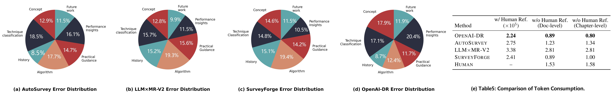

<div align="center">
<h1>SurveyBench: Can LLM(-Agents) Write Academic Surveys that Align with Reader Needs?</h1>
</div>

## Introduction

<p align="center">
  
</p>

SurveyBench is a fine-grained, quiz-driven evaluation framework, featuring 
(1) typical survey topics source from recent 11,343 arXiv papers and corresponding 4,947 high-quality surveys; 
(2) a multifaceted metric hierarchy that assesses the outline quality (e.g., coverage breadth, logical coherence), content quality (e.g., synthesis granularity, clarity of insights), and non-textual richness;
(3) a dual-mode evaluation protocol that includes content-based and quiz-based answerability tests, explicitly aligned with readers’ informational needs.

## Dataset Introduction
Our survey topic acquisition process is divided into three stages. 

First, we collect 127 candidate topics from authoritative computer science sources, including top conferences (e.g., ICLR, NeurIPS, CVPR, SIGMOD, SOSP), and refine them by removing duplicates and unifying terminology (e.g., merging “Brain-Computer Interfaces” and “Neural Coding”). 

Second, for each refined topic, we cluster recent arXiv papers from the past three months by calculating embeddings (using the text-embedding-3-small model) from titles, abstracts, and key topics, and apply t-SNE for dimensionality reduction and visualization. As shown in Figure 4, we filter these topics based on publication volume, conceptual diversity, academic influence (citation counts and top-tier venue presence), and semantic overlap, ultimately selecting 9 key representative topics. 

Finally, for each of the selected topics, we extract 4,947 survey papers from arXiv using “survey” or “review” keywords, and further filter them based on two criteria: (1) impact (citation counts from Semantic Scholar or arXiv-sanity), and (2) coverage depth (topical alignment with the retrieved papers), yielding a final set of 20 well-vetted topics for benchmark use.

## Usage

### Data Prepration

1. Place all generated survey files (`.md`) into the directory:
   
    ```
    src/data/{MethodName}/
    ```

2. Human-written reference surveys should be placed under:
    ```
    src/data/HumanSurvey/
    ```

**Requirements:**

- **Filename alignment:**  
For each topic, the `.md` filename must be **identical** between the LLM method directory and `HumanSurvey`.  

    For example:
    ```
    src/data/AutoSurvey/Multimodal Large Language Models.md
    src/data/HumanSurvey/Multimodal Large Language Models.md
    ```


- **Survey format requirement:**  
All survey files must follow a consistent Markdown heading structure.

    For example: 
    ```
    # Title
    ## 1 Introduction
    ## 2 Section
    ### 2.1 Subsection
    #### 2.1.1 Subsubsection
    ...
    ``` 

### Content-based Evaluation

Here is an example command to evaluate the `AutoSurvey` method on content quality, outline quality and richness.

```bash
cd src
python run_content_eval.py --mode overall --survey_dir '../data/AutoSurvey' --human_dir '../data/HumanSurvey' --model gpt-4o-mini --api_key sk_xxx --api_url xxx --output_dir './result/content/AutoSurvey'
```

**Arguments:**

- `mode` : Evaluation mode. Options:
  - `content` → Evaluate content quality (with/without human reference).
  - `outline` → Evaluate outline quality.
  - `richness` → Evaluate non-textual richness.
  - `overall` → Run all three evaluations (`content with_ref`, `outline`, `richness`).
- `setting` : (Only valid if `--mode content`) Content evaluation setting. Options:
  - `with_ref` → Compare LLM survey against the human-written survey.
  - `without_ref_chapter` → Evaluate content chapter by chapter without human reference.
  - `without_ref_document` → Evaluate the whole document without human reference.
- `--model` : The model used for evaluation (e.g. gpt-4o-mini).
- `--api_key` : API key for the evaluation model service.
- `--api_url` : API endpoint URL for the evaluation model service.
- `--output_dir` : Directory to save evaluation results.
- `--survey_dir`: Directory for survey files to evaluate.
- `--human_dir`: Directory for human-written survey files.


### Quiz-based Evalaution

Here is an example command to run **quiz-based evaluation** on generated surveys:

```bash
cd src
python run_quiz_eval.py \
  --survey_dir '../data/AutoSurvey' \
  --human_dir '../data/HumanSurvey' \
  --output './quiz_result' \
  --llm "gpt-4o-mini" \
  --llm_api_key "sk_xxx" \
  --llm_api_url "https://api.openai.com/v1" \
  --emb_model "text-embedding-3-small" \
  --emb_dimension 1536 \
  --emb_api_key "sk_xxx" \
  --emb_api_url "xxx"
```
**Arguments:**

- `--survey_dir` : Directory containing the generated survey files to evaluate.
- `--human_dir` : Directory containing the human-written survey files.
- `--output` : Directory to save evaluation results. Results will be stored in results/{your_output_dir}.
- `--llm` : The LLM used as a judge for quiz evaluation (e.g., gpt-4o-mini).
- `--llm_api_key` : API key for the LLM service.
- `--llm_api_url` : API endpoint URL for the LLM service.
- `--emb_model` : Embedding model used for semantic similarity calculation.
- `--emb_dimension` : Dimension of the embedding model.
- `--emb_api_key` : API key for the embedding model service.
- `--emb_api_url` : API endpoint URL for the embedding model service.


After running the script, evaluation results will be saved under `results/{your_output_dir}`.  
Two types of JSON files are generated:

1. **`{topic}_specific_results.json`**  
   - Contains the overall scores of *topic-specific quizzes* for the given topic.

2. **`{topic}_compare_results.json`**  
   - Contains the results of *general quiz* comparisons.  
   - To keep the file concise:  
     - `answer_1` refers to the **human survey** responses.  
     - `answer_2` refers to the **generated survey** responses.  

#### compare results JSON Structure

| Field | Description |
|-------|-------------|
| `better_answer_2_count` | Number of quiz questions where the generated survey (`answer_2`) outperformed the human survey (`answer_1`). |
| `better_answer_1_reasons` | List of questions where the human survey won, along with the LLM judge’s explanation. |
| `category_stats` | Win–loss statistics across 7 predefined quiz categories. |
| `total_questions` | Total number of quiz questions evaluated. |


## Experimental Results and Analysis

We evaluate four typical methods to verify the effectiveness of SurveyBench, including **AutoSurvey** (GPT-4o), **SurveyForge** (GPT-4o), **LLM×MapReduce-V2** (Gemini-flash-thinking), and **OpenAI-DeepResearch**.


| Dimension             | **OpenAI-DR** | **AutoSurvey** | **SurveyForge** | **LLM×MR-V2** |
|-----------------------|---------------|----------------|-----------------|---------------|
| **Outline Quality (1-5)** |               |                |                 |               |
| Coverage              | 3.39          | 3.83           | 3.86            | **4.31**      |
| Relevance             | 3.83          | 4.11           | 4.22            | **4.53**      |
| Structure             | 3.48          | 3.71           | 3.95            | **4.28**      |
| **Average**           | 3.57          | 3.88           | 4.01            | **4.37**      |
| **Content Quality (1-5)** |            |                |                 |               |
| Coverage              | **4.32**      | 3.90           | 3.90            | 4.03          |
| Depth                 | **4.40**      | 3.72           | 3.72            | 4.05          |
| Focus                 | **4.80**      | 4.35           | 4.28            | 4.62          |
| Coherence             | **4.25**      | 3.98           | 4.00            | 4.00          |
| Fluency               | **4.32**      | 4.20           | 4.25            | 4.30          |
| **Average**           | **4.42**      | 4.03           | 4.03            | 4.20          |
| **Richness**          |               |                |                 |               |
| Avg. Fig. Num.        | 0.60          | --             | --              | 4.10          |
| Avg. Table Num.       | 0.60          | --             | --              | **10.95**     |
| Total Avg.            | 1.78          | --             | --              | 5.04          |

*Table1: Content-Based Evaluation Results (w/ human referenced)*

**Note**: We (1) set the carefully selected human-written surveys scoring **5** in outline and content quality; and (2) test the human-written surveys that score **9.80**, 5.45, **11.68** in the three Richness metrics ($\lambda=10^5$).

---

| Method            | Easy (Concept) | Easy (Classification) | Easy (History) | Medium (Algorithm) | Medium (Application) | Medium (Profiling) | Hard (Prediction) | **Topic-related details** |
|-------------------|----------------|-----------------------|----------------|--------------------|----------------------|--------------------|-------------------|---------------------------|
| **AutoSurvey**    | 47.4%          | 24.6%                 | 65.4%          | 28.0%              | 40.0%                | 34.5%              | 53.3%             | 1.58                      |
| **SurveyForge**   | 39.7%          | 39.1%                 | 37.9%          | 20.0%              | 41.5%                | 56.7%              | 52.5%             | 1.48                      |
| **LLM×MR-V2**     | **57.7%**      | 48.1%                 | 50.0%          | 36.4%              | 48.6%                | **60.9%**          | 61.9%             | **3.19**                  |
| **OpenAI-DR**     | 53.8%          | **55.9%**             | **77.5%**      | **68.0%**          | **69.8%**            | 47.3%              | **69.2%**         | 1.97                      |

*Table2: Quiz-Based Evaluation Results*

---

| **Method**            | **Topic Recency** | **Coverage** | **Relevance** | **Structure** | **Avg.** | **Coverage** | **Depth** | **Focus** | **Coherence** | **Fluency** | **Avg.** |
|-----------------------|-------------------|--------------|---------------|---------------|----------|--------------|-----------|-----------|---------------|-------------|----------|
| **OpenAI-DR**         | **New**           | 3.15         | 3.60          | 3.35          | 3.37     | 4.10         | 4.20      | 4.65      | 4.10          | 4.15        | 4.24     |
|                       | **Old**           | 3.63         | 4.07          | 3.62          | **3.77** | 4.55         | 4.60      | 4.95      | 4.40          | 4.50        | **4.60** |
| **AutoSurvey**        | **New**           | 3.67         | 3.98          | 3.55          | 3.73     | 3.75         | 3.55      | 4.15      | 3.90          | 4.25        | 3.92     |
|                       | **Old**           | 4.00         | 4.23          | 3.87          | **4.03** | 4.05         | 3.90      | 4.55      | 4.05          | 4.15        | **4.14** |
| **SurveyForge**       | **New**           | 3.68         | 4.20          | 3.90          | 3.93     | 3.70         | 3.55      | 4.20      | 3.80          | 4.15        | 3.88     |
|                       | **Old**           | 4.03         | 4.23          | 4.00          | **4.09** | 4.10         | 3.90      | 4.35      | 4.20          | 4.35        | **4.18** |
| **LLM×MR-V2**         | **New**           | 4.33         | 4.53          | 4.30          | **4.39** | 3.90         | 3.95      | 4.45      | 4.00          | 4.30        | 4.12     |
|                       | **Old**           | 4.28         | 4.53          | 4.25          | 4.36     | 4.15         | 4.15      | 4.80      | 4.00          | 4.30        | **4.28** |

*Table3: Evaluation results on outline quality and content quality across **New** vs. **Old** topics.*

---
<p align="center">
  
</p>

*Figure 1: Fine-Grained Evaluation. (a-d): Error Distributions; (e) LLM Token Utilization.*


### Content-based Evaluation

Unlike inflated results observed without human-written references, we incorporate high-quality human-authored surveys as reference standards. 
As shown in Table1, LLM-based methods achieve strong results in content-focused metrics. 
For example, **OpenAI-DR** scores only 4% below humans in content focus, and **LLM×MR-V2** lags by just 9% in outline relevance, 
showing that LLM-generated surveys approach human surveys in readability and coherence. 
Among the methods, **LLM×MR-V2** excels in outline quality, while **OpenAI-DR** ranks highest in content quality, 
thanks to reinforcement learning tailored for complex retrieval. 
However, **OpenAI-DR** ranks lowest in outline quality due to its concise nature and lack of hierarchical sub-sections.

Additionally, **SurveyBench** supports the richness of generated surveys. As shown in Table1, 
human-written surveys score significantly higher in richness than LLM-based methods (e.g., **OpenAI-DR** scores ~5.56 times lower). 
Methods like **SurveyForge** and **AutoSurvey** lack diagram or table generation functionalities, 
while **LLM×MR-V2** generates a substantial number of tables (avg. 10.95) using a templating mechanism to produce images (e.g., Mermaid diagrams). 
Despite its rich outputs, **LLM×MR-V2** has a moderate richness score (5.04) due to its long outputs.

### Quiz-based Evaluation

We assess methods using both general and content-specific quizzes (Table2). 
All methods score low due to the fine-grained nature of the quizzes, which demand close alignment with human-written surveys. The findings are summarized as follows:

> **Finding 1:** *Insufficient detail*  
LLM-generated surveys tend to provide surface-level explanations, performing poorly in content-specific quizzes. For example, **OpenAI-DR** fails to answer detailed questions on multilingual instruction strategies due to a lack of nuanced discussion.

> **Finding 2:** *Lack of associative reasoning*  
LLM-generated surveys struggle with cross-concept connections. For instance, surveys fail to relate tile and pixel organization in rendering to CUDA programming architecture, missing deep cross-domain coverage.

> **Finding 3:** *Deficient synthesis and abstraction*  
LLM-generated surveys rarely synthesize or integrate key ideas. Many quizzes probing key methods or dimensions go unanswered, as LLMs lack robust abilities for independent induction and summarization.

> **Finding 4:** *Forward-looking content*  
Despite limitations, LLM-generated surveys often include future-oriented sections, showing some ability to analyze trends. Human authors may omit these sections, but LLM methods maintain them consistently due to their standardized structure.


### Error Distributions

As shown in Figure1 (a-c), there are three main observations. 
First, **OpenAI-DeepResearch** excels in algorithmic principles and structural classification, demonstrating strong technical depth. 
However, it struggles with comparative performance analysis and, at higher technical granularity, its accuracy in conceptual understanding declines. 
In contrast, **AutoSurvey** suffers most from errors in technology-related content, revealing a clear deficiency in both detailed technical knowledge and performance evaluation. 
Meanwhile, **LLM×MapReduce-V2** and **SurveyForge** show nearly identical error distributions, indicating shared implementation strategies. 
While both improve performance-insight comprehension, their understanding of deeper algorithmic mechanisms remains shallow.


### Token Consumption

As shown in Figure1 (e), **OpenAI-DeepResearch** incurs the lowest token usage among all methods, producing simple outlines with precise technical analysis. 
In contrast, **LLM×MR-V2** consumes 33.7% more tokens, producing finer chapter structures and incorporating non-textual elements like tables.

### Topic Recency

To examine the effect of topic recency, we sort the 20 evaluation topics based on the release time of the first versions of their corresponding human-written surveys, 
dividing them into 10 **New** and 10 **Old** topics. As shown in Table3, all methods perform better on old topics, 
suggesting that familiarity with the topic improves survey quality. 
**LLM×MapReduce-V2** leads overall, with average outline and content quality scores of **4.39** and **4.29** on old topics. 
Similar trends are observed for **AutoSurvey** and **SurveyForge**, though their improvements on old topics are less significant. 
These findings suggest that while current methods can generate competitive surveys on new topics, 
they perform better on well-established topics due to the availability of richer literature and mature research structures, 
while newer topics often lack accessible references and well-formed frameworks.


## Citation

```
@misc{sun2025surveybenchllmagentswriteacademic,
      title={SurveyBench: Can LLM(-Agents) Write Academic Surveys that Align with Reader Needs?}, 
      author={Zhaojun Sun and Xuzhou Zhu and Xuanhe Zhou and Xin Tong and Shuo Wang and Jie Fu and Guoliang Li and Zhiyuan Liu and Fan Wu},
      journal      = {arXiv Preprint},
      url       = {https://arxiv.org/abs/2510.03120},
      year         = {2025}
}
```