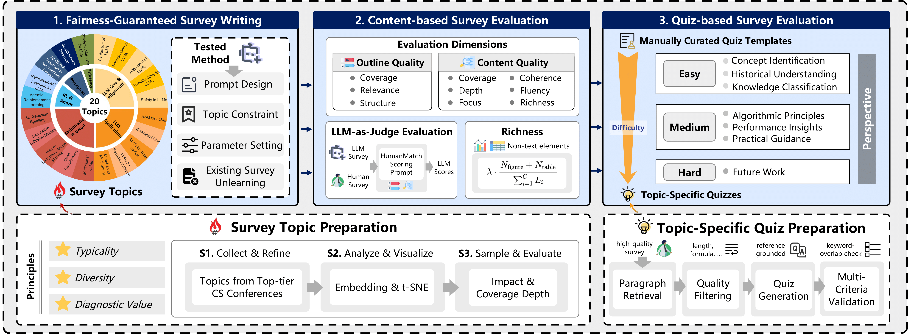

<div align="center">
<h1>SurveyBench: How Well Can LLM(-Agents) Write Academic Surveys?</h1>
</div>

## Introduction

<p align="center">
  
</p>

SurveyBench is a fine-grained, quiz-driven evaluation framework, featuring 
(1) typical survey topics source from recent 11,343 arXiv papers and corresponding 4,947 high-quality surveys; 
(2) a multifaceted metric hierarchy that assesses the outline quality (e.g., coverage breadth, logical coherence), content quality (e.g., synthesis granularity, clarity of insights), and non-textual richness;
(3) a dual-mode evaluation protocol that includes content-based and quiz-based answerability tests, explicitly aligned with readers’ informational needs.

## Usage

### Data Prepration

1. Place all generated survey files (`.md`) into the directory:
   
    ```
    src/data/{MethodName}/
    ```

2. Human-written reference surveys should be placed under:
    ```
    src/data/HumanSurvey/
    ```

**Requirements:**

- **Filename alignment:**  
For each topic, the `.md` filename must be **identical** between the LLM method directory and `HumanSurvey`.  

    For example:
    ```
    src/data/AutoSurvey/Multimodal Large Language Models.md
    src/data/HumanSurvey/Multimodal Large Language Models.md
    ```


- **Survey format requirement:**  
All survey files must follow a consistent Markdown heading structure.

    For example: 
    ```
    # Title
    ## 1 Introduction
    ## 2 Section
    ### 2.1 Subsection
    #### 2.1.1 Subsubsection
    ...
    ``` 

### Content-based Evaluation

Here is an example command to evaluate the `AutoSurvey` method on content quality, outline quality and richness.

```bash
cd src
python run_content_eval.py --mode overall --survey_dir '../data/AutoSurvey' --human_dir '../data/HumanSurvey' --model gpt-4o-mini --api_key sk_xxx --api_url xxx --output_dir './result/content/AutoSurvey'
```

**Arguments:**

- `mode` : Evaluation mode. Options:
  - `content` → Evaluate content quality (with/without human reference).
  - `outline` → Evaluate outline quality.
  - `richness` → Evaluate non-textual richness.
  - `overall` → Run all three evaluations (`content with_ref`, `outline`, `richness`).
- `setting` : (Only valid if `--mode content`) Content evaluation setting. Options:
  - `with_ref` → Compare LLM survey against the human-written survey.
  - `without_ref_chapter` → Evaluate content chapter by chapter without human reference.
  - `without_ref_document` → Evaluate the whole document without human reference.
- `--model` : The model used for evaluation (e.g. gpt-4o-mini).
- `--api_key` : API key for the evaluation model service.
- `--api_url` : API endpoint URL for the evaluation model service.
- `--output_dir` : Directory to save evaluation results.
- `--survey_dir`: Directory for survey files to evaluate.
- `--human_dir`: Directory for human-written survey files.


### Quiz-based Evalaution

Here is an example command to run **quiz-based evaluation** on generated surveys:

```bash
cd src
python run_quiz_eval.py \
  --survey_dir '../data/AutoSurvey' \
  --human_dir '../data/HumanSurvey' \
  --output './quiz_result' \
  --llm "gpt-4o-mini" \
  --llm_api_key "sk_xxx" \
  --llm_api_url "https://api.openai.com/v1" \
  --emb_model "text-embedding-3-small" \
  --emb_dimension 1536 \
  --emb_api_key "sk_xxx" \
  --emb_api_url "xxx"
```
**Arguments:**

- `--survey_dir` : Directory containing the generated survey files to evaluate.
- `--human_dir` : Directory containing the human-written survey files.
- `--output` : Directory to save evaluation results. Results will be stored in results/{your_output_dir}.
- `--llm` : The LLM used as a judge for quiz evaluation (e.g., gpt-4o-mini).
- `--llm_api_key` : API key for the LLM service.
- `--llm_api_url` : API endpoint URL for the LLM service.
- `--emb_model` : Embedding model used for semantic similarity calculation.
- `--emb_dimension` : Dimension of the embedding model.
- `--emb_api_key` : API key for the embedding model service.
- `--emb_api_url` : API endpoint URL for the embedding model service.


After running the script, evaluation results will be saved under `results/{your_output_dir}`.  
Two types of JSON files are generated:

1. **`{topic}_specific_results.json`**  
   - Contains the overall scores of *topic-specific quizzes* for the given topic.

2. **`{topic}_compare_results.json`**  
   - Contains the results of *general quiz* comparisons.  
   - To keep the file concise:  
     - `answer_1` refers to the **human survey** responses.  
     - `answer_2` refers to the **generated survey** responses.  

#### compare results JSON Structure

| Field | Description |
|-------|-------------|
| `better_answer_2_count` | Number of quiz questions where the generated survey (`answer_2`) outperformed the human survey (`answer_1`). |
| `better_answer_1_reasons` | List of questions where the human survey won, along with the LLM judge’s explanation. |
| `category_stats` | Win–loss statistics across 7 predefined quiz categories. |
| `total_questions` | Total number of quiz questions evaluated. |
